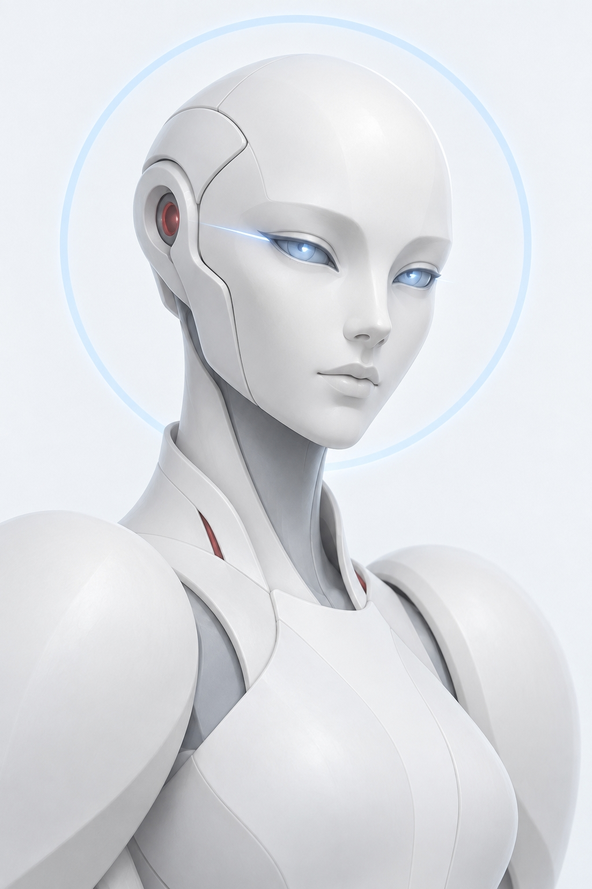
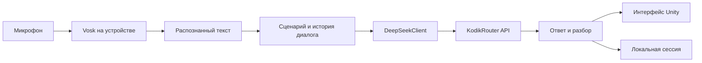

  

<h1 align="center">ArenaDebates</h1>

  Голосовой тренажёр переговоров: изучайте методы, распознавайте их в разговоре 
  и проверяйте свои аргументы в диалоге с ИИ-оппонентом.

  <strong>Unity 2022.3.52f1</strong> · <strong>C#</strong> · <strong>Vosk</strong> · <strong>DeepSeek через KodikRouter</strong>

  <a href="#скачать-и-запустить">Скачать игру</a> ·
  <a href="#что-есть-в-игре">Возможности</a> ·
  <a href="#как-это-работает">Техническая реализация</a> ·
  <a href="#запуск-проекта-в-unity">Для разработчиков</a>

---

## О проекте

**ArenaDebates** помогает тренировать переговоры на практике. Игрок выбирает цель, знакомится с методами ведения диалога, слушает примеры их применения и затем отвечает оппоненту голосом. В учебном режиме можно получить подсказку и разбор; в свободном — выбрать условия разговора и попробовать провести переговоры самостоятельно.

Игра сочетает **локальное распознавание русской речи** и **генерацию ответов через API**. Микрофонное аудио обрабатывается Vosk на устройстве; языковой модели отправляется распознанный текст и контекст диалога.

## Скачать и запустить

**[⬇ Скачать ZIP-сборку ArenaDebates](https://disk.yandex.ru/client/disk/ArenaDebatesApplication)**

Инструкция ниже рассчитана на **Windows-билд Unity в ZIP-архиве**:

1. Скачайте архив и **распакуйте его целиком** в отдельную папку. Не запускайте игру прямо из ZIP.
2. Запустите `ArenaDebates.exe` (или другой `.exe`, который лежит рядом с папкой `*_Data`). Не переносите исполняемый файл отдельно от остальных файлов сборки.
3. При запросе системы разрешите приложению доступ к микрофону. При первом запуске подготовка встроенной модели распознавания может занять некоторое время.
4. Создайте локальный профиль, выберите цель и проходите модули по порядку.

Для голосовых ответов нужен микрофон. **Распознавание речи работает локально**, а для ИИ-диалогов нужны интернет и настроенный доступ к KodikRouter. Если доступ к API в конкретной сборке не настроен, генерация реплик работать не будет.

## Что есть в игре

| Этап | Что делает игрок |
| --- | --- |
| **Выбор цели** | Выбирает отрасль и цель из каталога; игра предлагает подходящие переговорные методы. |
| **Обучение** | Изучает материалы по выбранным методам и отмечает пройденные темы. |
| **Аудирование** | Слушает разговоры, определяет применённый метод и объясняет свой выбор. |
| **Учебный диалог** | Тренируется говорить по конкретному методу с подсказками и разбором ответа. |
| **Свободный диалог** | Выбирает сложность оппонента, первого говорящего и число ходов; при желании задаёт свою ситуацию и включает или выключает анализ реплик. |

Модули открываются последовательно: доступ к диалогам появляется после обучения и аудирования. Прогресс и результаты сохраняются локально.

## Как это работает

**Клиент и интерфейс.** Приложение написано на C# в Unity 2022.3.52f1. Сцены собраны на Unity UI (uGUI) и TextMeshPro. Теория, темы, позиции, задания на аудирование и типы ответов хранятся в `ScriptableObject`, поэтому содержание можно менять в Inspector без переписывания логики.

**Распознавание речи.** Русская модель [`vosk-model-small-ru-0.22`](https://alphacephei.com/vosk/models) включена в проект ZIP-архивом. При первом запуске она распаковывается в постоянное хранилище приложения; дальше используется локально. Сцены диалога ограничивают одну голосовую запись 20 секундами. Аудиозапись не отправляется в KodikRouter.

**ИИ-диалог.** `DeepSeekClient` отправляет текстовый запрос через `UnityWebRequest` к OpenAI-совместимому API KodikRouter. В проекте указана модель `deepseek/deepseek-v4-flash-0731`. В запрос входят тема, позиции сторон, история реплик и параметры режима; результат используется для следующей реплики, разбора и подсказки.

**Данные и прогресс.** Каталог целей загружается из [`goals.json`](Assets/StreamingAssets/goals.json) в `StreamingAssets`. Профили и прогресс сохраняются в `users.json`, текущая игровая сессия — в `game_session.json` внутри `Application.persistentDataPath`. Серверной синхронизации профилей нет.

| Где искать | Назначение |
| --- | --- |
| [`Assets/Scenes`](Assets/Scenes) | Сцены входа, меню, обучения, аудирования и обоих режимов диалога. |
| [`Assets/Scripts/UI`](Assets/Scripts/UI) | Контроллеры экранов, кнопок и отображения результата. |
| [`Assets/Scripts/Core`](Assets/Scripts/Core) | Игровая сессия, ходы и сохранение состояния диалога. |
| [`Assets/Scripts/Integration`](Assets/Scripts/Integration) | Интеграция Vosk и запросы к ИИ. |
| [`Assets/StreamingAssets`](Assets/StreamingAssets) | JSON-каталог целей и архив модели распознавания. |
| [`Assets/TechDescription/Техническое_описание.txt`](Assets/TechDescription/Техническое_описание.txt) | Более подробное техническое описание проекта. |

## Запуск проекта в Unity

1. Откройте корень репозитория в **Unity Hub** с редактором **2022.3.52f1**. Пакеты подтянутся из `Packages/manifest.json`.
2. Откройте `Assets/Scenes/LoginScene.unity` и запустите Play Mode. Сцены приложения уже добавлены в Build Settings.
3. Для проверки ИИ-диалогов настройте собственный ключ KodikRouter в компонентах `DeepSeekClient` сцен `DialogScene` и `LearningDialog`. Проверьте доступ ключа к модели `deepseek/deepseek-v4-flash-0731`.
4. Для проверки речи подключите микрофон и убедитесь, что архив модели Vosk и нативные библиотеки для выбранной платформы входят в сборку.
5. Для выпуска Windows-версии соберите проект через **File → Build Settings → Build**, затем положите **все** файлы полученного билда в один ZIP-архив.

## Важные ограничения

- ИИ-реплики зависят от доступности KodikRouter, лимитов API и интернет-соединения. Локальное распознавание речи от них не зависит.
- Локальные профили не являются защищённой системой авторизации: в текущей реализации пароль хранится как обычная строка. Не используйте пароль от других сервисов.
- Ключ API в файлах сцены или публичной клиентской сборке можно извлечь. Для открытого релиза нужен серверный посредник; действующие секреты не следует публиковать в репозитории.

## Сторонние компоненты и лицензии

В проекте используются [Unity 2022.3](https://docs.unity3d.com/2022.3/Documentation/Manual/index.html), [Vosk и русская модель распознавания](https://alphacephei.com/vosk/models), а также [KodikRouter](https://kodikrouter.ru/docs/integrations) для доступа к языковой модели. Лицензии встроенных библиотек находятся рядом с ними в `Assets/Plugins`.

Отдельная лицензия на **исходный код ArenaDebates** в корне репозитория пока не указана. Если хотите использовать материалы или код за пределами проекта, согласуйте это с автором.

Нашли ошибку или хотите предложить улучшение? [Создайте issue](https://github.com/DesyaIO/ArenaDebates/issues).
